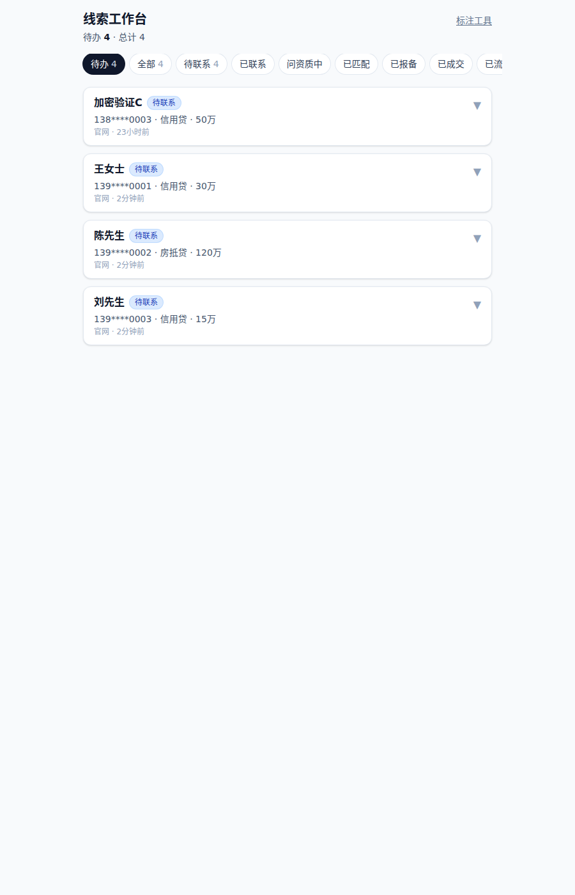
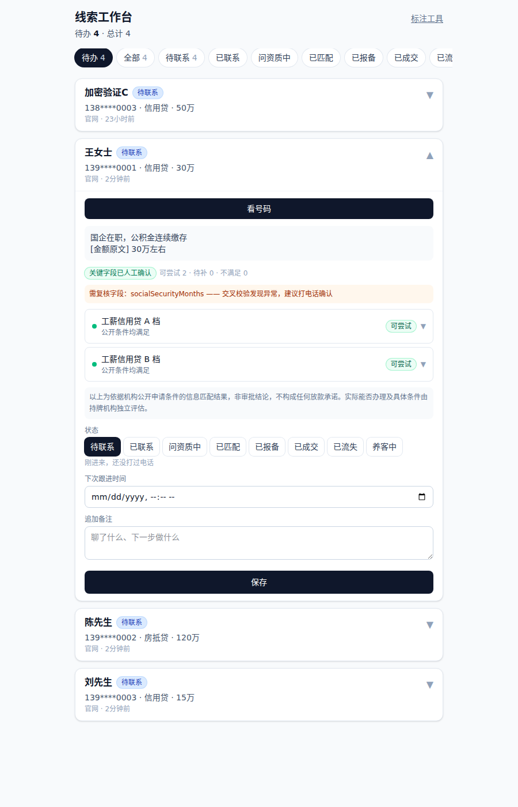

# 安知策 CRM — 贷款撮合线索系统 + LLM 抽取管线

一个真实在跑的业务系统：从公网官网接收贷款咨询线索，用 LLM 把非结构化对话抽成结构化资质字段，再用规则引擎做产品匹配。

这个仓库想展示的不是"我会调 LLM API"，而是**怎么判断一个 LLM 功能能不能上生产**。核心内容是下面那套 eval 框架和它暴露出的四个真实缺陷。

技术栈：Next.js 16（App Router）· TypeScript · PostgreSQL + Drizzle ORM · Zod · 阿里云百炼（Qwen）· Vitest

---

## 一、为什么先建 eval，再谈功能

抽取管线的输出会直接影响"这个客户能不能推给机构"。判断错了有两种代价，**而且完全不对称**：

| 错误类型 | 后果 | 可恢复性 |
|---|---|---|
| 漏抽（客户说了，模型没抽到） | 人工补问一句 | 容易 |
| **幻觉**（客户没说，模型编了个数字） | 按错误资质推单，机构那边过不了 | **难 —— 损害的是中介关系** |

所以这个项目**不报单一准确率**。一个 96% 的模型如果错的全是幻觉，比 92% 但只会漏抽的模型更危险。

评测拆成六类错误分型，硬字段（收入 / 社保 / 公积金 / 征信查询次数 / 负债 / 营业年限）单独统计 —— 这六个字段直接决定能不能推单。

```
src/lib/eval/score.ts     六类错误分型 + HARD_FIELDS 单列统计
src/lib/eval/samples.ts   24 条测试样本，每条针对一个具体考点
scripts/run-eval.ts       跑评测、落库、出报告
```

### ⚠️ 关于下面的数字

**测试集是 24 条人工构造的样本，不是生产数据。** 这些数字的用途是**回归测试**（改 prompt 后有没有把旧 bug 带回来），不能当作生产环境准确率。

系统上线时间短，真实对话样本量还不足以支撑统计意义上的性能声明。把合成样本的分数说成生产表现是不诚实的，这里明确区分开。

**另外：单次 eval 的小数点后一位不可信。** 理由见下面第三节的重复测量数据 —— 同模型同样本同 `temperature=0`，三次结果并不完全一致。所以下面所有单次数字都应理解为「落在某个区间内的一次采样」，不是定值。

---

## 二、三模型对比（extract-v2 prompt，同一批 24 样本）

| 模型 | 全字段 | 硬字段 | 幻觉率 | 过度精确 | 漏抽 | P50 延迟 |
|---|---|---|---|---|---|---|
| **qwen-plus** | 100.0% | 100.0% | 0.0% | 0.0% | 0.0% | 4188ms |
| qwen-flash | 97.8% | 99.3% | 0.3% | 0.0% | 1.4% | 1899ms |
| qwen-turbo | 94.7% | 96.5% | 2.2% | 0.8% | 1.9% | 1811ms |

三家 token 消耗几乎一致（约 31.3k 入 / 4.45k 出），成本差就是单价差。

72 次调用全部落 `extraction_runs` 表，可回溯。

**这张表是三个模型各跑一次，条件相同，用于横向比较。** 单次数字的抖动范围见下一节 —— 之所以不把 plus 换成多轮均值再跟单轮的 flash/turbo 比，是因为那会让分母不一致，比较本身就失效了。

---

### 从对比里读出来的三件事

**1. flash 的错误高度集中。** 8 个错里 7 个是同一个字段 `incomeBasis`（`unknown` 与 `null` 的细微区分），硬字段只错 1 个。**这种模式只有逐字段统计才看得见** —— 如果只看 97.8% 这个总分，会误判成"整体略差"，实际是"一个字段的定义没说清"。修 prompt 比换模型便宜得多。

**2. 结构化 schema 的防御力依赖模型能力。**

我设计了一个 `approxNumber` 类型：表述模糊时 `value` 必须为 `null`，只能填区间。本以为这是 schema 层的硬约束 —— turbo 照样绕过，把"三年多"填成 36、"三十万左右"填成 300000。

**约束写在 schema 里，执行还在模型手上。** 这比"我用了 JSON mode"要深一层：结构化输出保证的是格式合法，不是语义正确。

**3. 生产选 plus，不选 flash。**

这个结论推翻了我自己上一轮的判断。算术很简单：当前线索量约 3 条/天，plus 与 flash 的成本差是分币级别；4s 与 2s 的延迟差对后台异步任务没有意义。

**成本优化要到 10000 次/天才有讨论价值。** 在 3 条/天的量级上为省几分钱牺牲 2.2 个百分点的准确率，是把工程直觉用错了地方。

---

## 三、重复测量：`temperature=0` 不等于确定性输出

qwen-plus + extract-v2 + 同一批 24 样本，连续跑三次（2026-08-29）：

| 轮次 | 全字段 | 硬字段 | 幻觉率 | P50 延迟 |
|---|---|---|---|---|
| 第 1 次 | 99.7% | 100.0% | 0.3% | 4155ms |
| 第 2 次 | 100.0% | 100.0% | 0.0% | 4266ms |
| 第 3 次 | 99.7% | 100.0% | 0.3% | 4184ms |
| **均值** | **99.8%** | **100.0%** | 0.2% | 4202ms |
| 样本标准差 | 0.17pp | 0 | 0.17pp | 46ms |

每轮 24 样本 × 15 字段 = 360 次字段级判定。99.7% 与 100.0% 的差别是**一次**判定翻转（359/360 对 360/360）。

### 为什么要做这件事

上一版 README 里写着「单次 eval 小数点后一位不可信，应多次取均值与方差」—— 但没做。**自己写下的方法论要求没有执行，比没写更糟**：读到那句话的人会追问跑了几次，答不上来就说明这句话是抄来的，不是自己的实践。

### 从三轮数据里读出来的两件事

**1. 波动落在非硬字段上，硬字段零方差。** 三轮里硬字段（收入 / 社保 / 公积金 / 征信查询次数 / 负债 / 营业年限）全部 360/360，翻转的那一次判定是非硬字段的一次幻觉。这个分布对系统是有利的 —— **会抖的字段不参与推单决策，决定能不能推单的六个字段是稳的。**

**2. `temperature=0` 只降低随机性，不消除。** 同一份输入三次得到两种结果，说明服务端的采样、批处理、浮点累加顺序都可能引入差异。因此把「某次跑出 100%」当作能力声明是错的；正确的用法是**把区间当回归门禁** —— 改 prompt 后掉出 99.8 ± 0.17 这个带宽，就说明引入了退化，而不是「今天运气不好」。

### 这个数字不能用来做什么

分母仍是 24 条人工构造样本。99.8% 是**回归基线的稳定性**，不是生产准确率。真实对话的措辞混乱程度远高于合成样本，这个数字必然会掉。

---

## 四、v1 → v2：四个根因

第一版整体 98.8%，`schema_invalid` 率 4.2%。逐条看失败样本后发现的四个问题，比那个分数本身有价值：

### 1. `schema_invalid` 是我的 schema 太苛刻，不是模型的错

模型只少返回 `companyType` 一个键，其余 14 个字段全对 —— 整条被判失败。

但业务上"缺这个键"和"显式返回 null"含义完全相同。**是我把校验规则写得比业务需求严。**

→ 每个字段加 `.default(null)`，另外导出 `EXTRACTION_KEYS` 专门检测漏键（区分"漏了"和"说了没有"）。`schema_invalid` 从 4.2% 降到 0。

### 2. 字段名本身在误导模型（最值得记的一条）

原字段名 `hasCar`。输入："有辆车，全款的，没有车贷。"

模型输出 `hasCar: true`。**它答得没错 —— 它回答的是"有车吗"，而我想问的是"有车贷吗"。**

我第一反应是在 prompt 里加规则解释。改名 `hasCarLoan` 后直接正确，一条规则都没加。

**命名即 prompt。** 字段名是模型看到的第一份指令，比 prompt 正文里的补充说明权重更高。这条现在是我写 schema 的默认检查项。

### 3. 漏抽是 prompt 的逻辑漏洞，不是模型能力问题

`hasProvidentFund` 持续漏抽。输入："公积金交了 36 个月。"

原因是 prompt 里有条铁律"不许推测未提及的项"。模型严格遵守了 —— 它不敢从"交了 36 个月"推出"有公积金"。

**规则之间打架了**，模型选择了更保守的那条。

→ 补一条铁律：数值字段有值时，对应布尔字段同步为 true。反过来不成立（"公积金一直交着"填不出月数）。

### 4. 空值语义必须在 prompt 里说死

`incomeBasis` 在完全没提收入时被填成 `unknown`。正确应该是 `null`。

`null`（没提）和 `unknown`（提了但说不清）在业务上是两件事：前者要去问，后者要换个方式问。这个区分不写进 prompt，模型会自己选一个。

---

## 五、架构：为什么门户站不直连数据库

官网（公网）和 CRM 是两个独立服务。线索传递有两种做法：

**A. 官网直连 CRM 的 PostgreSQL**
**B. 官网 POST 到 CRM 的写入接口** ← 采用

选 B 的理由是威胁模型，不是代码优雅度：

官网是主要攻击面（公开表单、公开页面、SEO 流量）。一旦被拿下：

- A 方案泄露的是**数据库凭据** → 攻击者能拉走全部存量客户手机号
- B 方案泄露的是**一张只能写入的令牌** → 只能往里塞数据，读不到任何存量

代价是要自己处理幂等和失败重试。这个代价我认。

```
官网表单 ──┬─→ SQLite（兜底缓冲，CRM 挂了不丢线索）
           └─→ POST /api/ingest/leads ──→ CRM PostgreSQL
                  x-ingest-token           （正式归宿）
```

几个具体决定：

- **入库接口只有 POST，没有 GET。** 令牌泄露也拉不走存量数据
- **令牌只从请求头取，不支持查询串。** 查询串会进 nginx 访问日志，令牌落盘等于长期泄露
- **走本地回环（127.0.0.1）而非公网域名。** 省一次 TLS 握手是次要的，主要是令牌不出网卡
- **重复提交返 200 + `duplicate: true`，不返 409。** 客户填两次表是常见行为（第一次没等到回复），409 会让官网误判成失败而重试，反而制造噪音
- **官网侧使用独立加密密钥，不与 CRM 共用。** 共用密钥意味着攻破官网就等于拿到解密 CRM 全库的钥匙，那上面这套隔离就白做了

---

## 六、个人信息处理

手机号是这个系统里最敏感的字段，存三种形态：

| 列 | 内容 | 用途 |
|---|---|---|
| `phone_enc` | AES-256-GCM 密文 | 库文件被拷走也读不出号码 |
| `phone_hash` | HMAC-SHA256 + pepper | 唯一索引去重、精确查找 |
| `phone_mask` | `138****8000` | 界面展示 |

为什么需要三列：密文每次 IV 不同，同一号码两次加密结果不同，**没法用来去重**；指纹恒定但不可逆；加 pepper 是防止拿手机号字典反推库里有哪些号。

访问控制：

- **列表查询绝不 `select phone_enc`，只返回掩码。** 一次请求泄露 500 个号码和泄露 1 个，风险差两个量级
- **解密走 `POST /api/leads/[id]/phone`，一次一条，每次写审计日志。** 用 POST 不用 GET：GET 会被浏览器预取、被中间层缓存、URL 进访问日志
- **审计日志只记掩码，不记明文** —— 否则日志本身成了新的泄露源
- 未认证的 API 返回 **404 而非 401**，不向扫描器确认端点存在
- 认证中间件 fail closed：`SESSION_SECRET` 缺失时拒绝全部请求

---

## 七、资质匹配为什么不用 LLM

抽取用 LLM，**匹配用规则引擎**。

原因是可解释性。"这个客户为什么不匹配这款产品"必须能给出确定答案："征信近 3 个月查询 8 次，超过该产品上限 6 次"。

LLM 给不出这种可审计的因果链，而且同样输入可能得到不同结论。金融相关判断上，**可解释性优先于准确率**。

LLM 负责它擅长的部分：把"我在这家干了三年多，一个月到手一万五"变成结构化字段。判断留给规则。

---

## 八、盲标纪律

`gold_labels`（人工标注的基准答案）是所有评测数字的地基。如果标注时能看到模型输出，人会不自觉地被带偏 —— 这会让整套 eval 失去意义。

所以 `src/lib/gold/queries.ts` **不 join 任何模型输出表**（`extraction_runs` / `qualifications`）。

这个纪律靠"没有数据通路"保证，不靠标注人自觉。标注界面上根本渲染不出模型的答案。

另外几个标注 UI 的决定：

- 数值字段用「未提及 / 精确 / 模糊」三选，选"模糊"时 `value` 强制为 null —— 规则由 UI 保证，不靠标注人记得
- 布尔字段是三个并排按钮（是 / 否 / 未提及），不用勾选框。勾选框天然只有两态，`null` 会被误当 `false`，而这个区分正是"空值判定正确率"的判定基础
- 所有字段初始为「未填」，不预选任何选项。第一版曾把「未提及」设为默认选中，结果分不清"我判断这条没提"和"我忘了填"

---

## 九、线索工作台

使用场景是硬约束：**单人操作，多数时候在车上、单手、竖屏。**



默认落在「待办」，列表只出掩码手机号 —— 明文永不随列表下发。

展开卡片后点「看能推哪些产品」，规则引擎按需计算（不预取，列表上百条时预取等于把 5 款产品 × N 条线索全算一遍）：



这张图里有四处是刻意设计的：

- **资质来源标签**（「关键字段已人工确认」）—— 基于未核实的 LLM 抽取值去跟机构报备是会出事的，人得知道自己在看什么质量的数据
- **复核提示**（橙色条）—— `socialSecurityMonths` 是模糊值「交了三四年」，判定按下界 36 个月算，但仍标出来建议电话确认
- **三态判定** —— 「可尝试 / 待补 / 不满足」三个计数分开，不知道绝不等于不满足
- **免责声明不可折叠** —— 撮合方无金融牌照，这是法律边界不是 UI 品味

截图中的人名与手机号均为构造的演示数据。

- 默认视图是「待办」不是「全部」，打开第一眼是"现在该打给谁"
- 卡片流不用表格 —— 表格在手机上必然横向滚动，单手滚不了
- 待办排序「老的在前」：放着不管越久的越该先打
- 折叠态只放判断优先级需要的信息，展开才出现操作按钮，避免误触
- 拿到号码直接 `tel:` 唤起，不要求先进详情页

一条业务规则写进了代码强制：**转为「养客中」必须填重捞时间，否则接口返 400。**

征信查询次数会随时间衰减、社保月数会自然增长 —— 今天不过的客户三到六个月后可能就过了。**被拒线索是资产，不是垃圾。** 但没有重捞时间的"养客中"等于把线索扔进黑洞：不进待办列表，也没人会想起来。所以这条不能靠自觉，得靠 400。

同理，接口不接受修改 `name` / `phone`：手机号是线索身份（`phone_hash` 唯一索引），改它等于换人，应该新建线索。堵住这个口子是为了不让审计链断裂。

---

## 十、本地运行

```bash
pnpm install

cp .env.example .env.local   # 填入下方环境变量
pnpm db:migrate

pnpm typecheck               # tsc --noEmit
pnpm test                    # vitest，47 个用例
pnpm dev
```

跑评测：

```bash
pnpm gold:seed               # 灌入 24 条基准样本（--reset 只清合成样本）
pnpm eval                    # 默认 qwen-plus
pnpm eval --model qwen-flash --limit 10
pnpm eval --no-save          # 不落库，调试用
```

报告输出到 `eval-reports/`（已 gitignore —— 含对话原文）。

### 环境变量

| 变量 | 用途 |
|---|---|
| `DATABASE_URL` | PostgreSQL 连接串 |
| `FIELD_ENCRYPTION_KEY` | 字段加密密钥，32 字节 base64 |
| `PHONE_HASH_PEPPER` | 手机号指纹 pepper，32 字节 base64 |
| `SESSION_SECRET` | 会话签名密钥 |
| `ADMIN_PASSWORD_HASH` | argon2id 密码哈希 |
| `INGEST_TOKEN` | 官网投递线索的写入令牌 |
| `BAILIAN_API_KEY` | 阿里云百炼 API key |
| `BAILIAN_BASE_URL` | 百炼 OpenAI 兼容端点 |

生成密钥：`openssl rand -base64 32`

> `ADMIN_PASSWORD_HASH` 的值形如 `$argon2id$v=19$m=...`。Next.js 用 dotenv-expand 解析 `.env.local`，会把 `$argon2id` / `$v` / `$m` 当变量引用吃掉 —— 这个值必须用单引号包裹。

---

## 十一、当前状态与欠账

**已完成**：抽取管线 · eval 框架 · 官网线索入库 · 线索工作台 · 标注工具 · 认证与字段加密

**明确欠着的**：

- **真实性能数字**。基准集全是合成样本，只能做回归测试。要出可信的生产数字，需要积累真实对话并重新标注
- **重复测量只做了 plus。** flash 与 turbo 仍是单次数字，严格说它们在对比表里的排序有 0.2pp 级别的不确定性。三模型各跑三轮才算完整，但结论（选 plus）不会因此改变，所以排在后面
- pgvector 语义检索
- 官网侧限流用内存 Map，进程重启即清零，可被绕过

---

## 附：一点方法论

这个项目里最花时间的不是写功能，是**逐条看失败样本**。

三模型对比那张表花了不到一小时（脚本跑完就有），但第四节那四个根因花了整个下午 —— 每一条都是打开失败样本、对比模型输出和标注答案、猜假设、改一处、重跑验证。

四条里有三条的根因**不在模型上**：一条是我的 schema 太严，一条是字段名在误导模型，一条是我自己写的两条 prompt 规则互相打架。

如果只看总分 98.8% 就上线，这三个问题会一直在，而且永远归因成"模型能力不够"。
